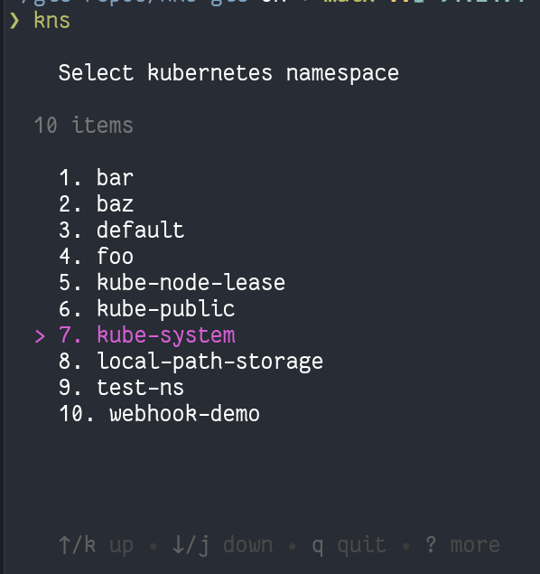

# kns

`kns` is a terminal user interface (TUI) tool for quickly switching the active namespace in your Kubernetes kubeconfig file. It lists all namespaces in your current Kubernetes context and lets you interactively select one, updating your kubeconfig accordingly. Its built on top of the `bubbltea` framework available at https://github.com/charmbracelet/bubbletea.

# Prerequisites
- You will need a valid kubeconfig file that has access to a Kubernetes cluster.
- The `KUBECONFIG` environment variable should be set to point to your kubeconfig file, or it will default to `~/.kube/config`. In-cluster configurations will not work.
- You should have relevant permissions to list all namespaces in the cluster.
- You should have permission to read a namespace from the kubernetes cluster.
- You should have write permissions to update the kubeconfig file.

## Features

- Lists all namespaces in the current Kubernetes context.
- Interactive TUI for namespace selection using keyboard navigation.
- Updates your kubeconfig file to set the selected namespace as default for the current context.
- Works with the kubeconfig file specified by the `KUBECONFIG` environment variable or defaults to user's home directory.


## Screenshot


## Installation

- Download the latest release binary from the [releases page](https://github.com/prit342/kns/releases).

- If you have Go installed, you can also run:
```sh
go install github.com/prit342/kns@latest
```

## Building from Source
Clone the repository and build the binary:

```sh
git clone https://github.com/prit342/kns.git
cd kns
go build -o kns .
```

## Usage

### Intervactive mode - simply run the binary:

```sh
./kns
```

- Use the arrow keys to navigate the list of namespaces.
- Press `Enter` or `Space` to select a namespace.
- Press `q` or `Ctrl+C` to quit without making changes.

### Command Line Mode - Switch to a specific namespace directly:
```sh
kns <namespace>
```

## Requirements

- Go 1.24.1 or higher.
- Access to a Kubernetes cluster and a valid kubeconfig file.

## Project Structure

- `main.go`: Entry point for the CLI application.
- `k8s/service.go`: Kubernetes client logic for connecting to a K8s cluster and listing namespaces.
- `k8s/interface.go`: Interface definitions.
- `k8s/update_kubeconfig.go`: Logic for updating the kubeconfig file with the selected namespace.
- `tui/tui.go`: TUI implementation using Bubble Tea and Bubbles.


## TODO List
- [x] Add functionaly to run `kns <namespace>` to switch to a specific namespace directly from the command line.
- [ ] Add various tests
